# `jss init` Command Flow

> Áp dụng cho `jss-devtools` v1.x (ESLint 8.x). Cập nhật theo code hiện tại.

## Overview

Flow của command `init`: detect → interactive/args → **linter check → package conflict resolution → install → formatter (ESLint+Prettier) → husky + alias (song song)**.

Nguyên tắc UX xuyên suốt: **không touch / không conflict → không thông báo** (silent).

## Flow Diagram

```mermaid
flowchart TD
    Start([Start: jss init]) --> Banner[Display Banner]
    Banner --> DetectPM[Detect Package Manager<br/>lockfile → default npm]
    DetectPM --> CheckMode{Any flag set?<br/>-y/framework/tailwind/storybook/aliasImport}

    %% Answers
    CheckMode -->|Yes| ResolveArgs[Resolve Answers from Args<br/>default: node, tailwind, aliasImport]
    CheckMode -->|No| Prompts[Interactive Prompts:<br/>framework → tailwind → storybook → aliasImport]
    Prompts -->|cancel| Exit1([exit 1])
    ResolveArgs --> PkgCheck
    Prompts --> PkgCheck

    %% package.json
    PkgCheck{package.json exists?} -->|No| WritePkg[Create default package.json]
    PkgCheck -->|Yes| DetectRepo
    WritePkg --> DetectRepo

    %% === ENHANCED DETECTION ===
    DetectRepo[Detect Repo State<br/>packages, versions, framework, linter] --> LinterCheck

    LinterCheck{Linter coexistence?<br/>ESLint/none → silent}
    LinterCheck -->|Biome/Oxlint/mixed| LinterPrompt[Warn bold + confirm<br/>default: continue]
    LinterCheck -->|ESLint or none| ConflictDetect
    LinterPrompt -->|cancel| Abort([Cancel: no changes])
    LinterPrompt -->|continue| ConflictDetect

    ConflictDetect[detectPackageConflicts<br/>installed ∩ intended ranges]
    ConflictDetect --> ConflictKind{Incompatible<br/>diff major?}
    ConflictKind -->|No / compatible only| BuildPlan
    ConflictKind -->|Yes| ConflictPrompt[Warn block:<br/>name^x.y.z → name^x.y.z<br/>select default: Overwrite]
    ConflictPrompt -->|cancel| Abort
    ConflictPrompt -->|skip| BuildPlan
    ConflictPrompt -->|overwrite| BuildPlan

    BuildPlan[buildInstallPlan<br/>skip installed unless overwrite] --> Confirm

    %% Confirm install
    Confirm{confirmInstallation}
    Confirm -->|nothing to install| Formatter
    Confirm -->|non-interactive| Execute
    Confirm -->|interactive select| UserChoice[default: Install now<br/>then Save-only / Cancel]
    UserChoice -->|cancel| Abort
    UserChoice -->|save-only| SavePkg[Save to package.json]
    UserChoice -->|install| Execute[Execute via PM]

    SavePkg --> Formatter
    Execute --> Formatter

    %% Formatter
    Formatter[Setup Formatter] --> Eslint9{ESLint 9.x<br/>detected?}
    Eslint9 -->|Yes| SkipEslint[Warn + skip ESLint gen]
    Eslint9 -->|No| PrettierCfg
    SkipEslint --> PrettierCfg

    PrettierCfg{Prettier config?}
    PrettierCfg -->|target format only| SilentP[Silent overwrite .prettierrc.json]
    PrettierCfg -->|none| SilentP
    PrettierCfg -->|other formats| CfgPrompt[Prompt Replace/Keep/Cancel<br/>default Replace]
    CfgPrompt -->|cancel| Abort2([Cancel: no further changes])
    CfgPrompt -->|replace/keep| EslintCfg
    SilentP --> EslintCfg

    EslintCfg{ESLint config?}
    EslintCfg -->|target format only| SilentE[Silent overwrite eslint.config.mjs]
    EslintCfg -->|none| SilentE
    EslintCfg -->|other formats| EslintCfgPrompt[Prompt Replace/Keep/Cancel]
    EslintCfgPrompt -->|cancel| Abort2
    EslintCfgPrompt -->|replace/keep| Scripts
    SilentE --> Scripts[Update package.json:<br/>format script + lint-staged]

    %% Parallel
    Scripts --> Parallel[Parallel]
    Parallel --> Husky[Setup Husky<br/>git init if needed, pre-commit]
    Parallel --> Alias[Setup Alias Import<br/>merge tsconfig paths]
    Husky --> Done([✔ Setup completed!])
    Alias --> Done

    classDef proc fill:#e1f5ff,stroke:#01579b,stroke-width:2px
    classDef dec fill:#fff9c4,stroke:#f57f17,stroke-width:2px
    classDef ok fill:#c8e6c9,stroke:#2e7d32,stroke-width:2px
    classDef err fill:#ffcdd2,stroke:#c62828,stroke-width:2px
    classDef par fill:#f3e5f5,stroke:#6a1b9a,stroke-width:2px
    class DetectPM,ResolveArgs,Prompts,WritePkg,DetectRepo,ConflictDetect,BuildPlan,SavePkg,Execute,SilentP,SilentE,Scripts,Husky,Alias,SkipEslint,Banner proc
    class CheckMode,PkgCheck,LinterCheck,ConflictKind,Confirm,UserChoice,Eslint9,PrettierCfg,EslintCfg,CfgPrompt,EslintCfgPrompt,LinterPrompt,ConflictPrompt dec
    class Done ok
    class Exit1,Abort,Abort2 err
    class Parallel,Formatter par
```



## Detailed Flow

### 1. Init + Answers

- `displayBanner()` (figlet).
- `detectPackageManager()`: theo lockfile (`bun.lock[b]` → `pnpm-lock.yaml` → `yarn.lock` → `package-lock.json`), default `npm`.
- **Non-interactive** (bất kỳ flag): `resolveAnswers(args)` — validate framework (`node|react|react-native|nextjs`), default `{ framework:'node', tailwind:true, storybook:false, aliasImport:true }`.
- **Interactive**: `group()` — framework (select) → tailwind (confirm, nếu ≠node) → storybook (confirm, nếu ≠node) → aliasImport (confirm). `onCancel` → `process.exit(1)`.

### 2. package.json

Nếu không có → tạo default (`name` từ cwd dir, `version:1.0.0`, `scripts.test`).

### 3. Enhanced Detection & Confirmation

Đây là phần thay đổi lớn so với bản cũ.

**3.1 detectRepoState()** — read-only, trả về:

```ts
{
  hasPackageJson, installedPackages: Set, packageVersions: Map<name,range>,
  framework?, tools: { eslint, prettier, husky, lintStaged },
  linter: { type, version, configFiles, hasConflict, packages[] }  // eslint|biome|oxlint|mixed|none
}
```

**3.2 Linter coexistence (`confirmLinterCoexistence`)**

- ESLint-only hoặc không linter → **silent continue** (jss-devtools dùng ESLint).
- Biome / Oxlint / mixed → `⚠️ Detected existing linter(s): **Biome**, **Oxlint**` → `confirm` default **continue=true**.
- `-y` → auto continue. Cancel → abort.

**3.3 Package conflicts (`resolvePackageConflicts`)**

- `getIntendedRanges(answers)` → full list từ `peerDependencies` (không network).
- `detectPackageConflicts(installed, intended)` → mỗi pkg: `isCompatible` (cùng major).
- Incompatible → resolve planned version thật (`buildPkgRange`, npm, cache) cho display.
- Compatible only → **silent** (không log).
- Incompatible → 1 block warn gọn, mỗi pkg 1 dòng, cả 2 vế bold:
  ```
  ⚠️  Detected version conflicts:
     eslint-plugin-react^1.0.0 → eslint-plugin-react^7.37.5
  ```
  → `select` default **Overwrite** / Skip / Cancel. Trả `{ proceed, overwrite[] }`.
- `-y` → skip tất cả silently. Cancel → abort.

**3.4 buildInstallPlan(answers, repoState, overwrite[])**

- Skip installed packages **trừ** những pkg trong `overwrite[]` (user chọn overwrite).
- Resolve version thật từ npm cho `toInstall[]`.

**3.5 confirmInstallation**

- Summary: `📦 N devDependencies to add: • pkg@x.y.z`. Nếu rỗng → "Nothing to install".
- **Không** log "Skipped (already installed)" nữa (silent).
- `-y` hoặc rỗng → auto install.
- Interactive → `select` default **Install now** / Save-only / Cancel. Cancel → abort.

**3.6 Execute**

- `save-only` → `saveToPackageJson` (merge devDependencies, sort).
- `install` → `executeInstall` qua PM (prod rồi dev, sequential tránh race).

### 4. Formatter (sequential, có thể abort toàn bộ)

**ESLint 9 guard:** nếu detect ESLint 9.x → warn "v1.x supports ESLint 8.x only" + skip generation.

**Prettier:**

- Detect configs (`.prettierrc.*`, `prettier.config.*`, `package.json#prettier`).
- **Fast path:** nếu tất cả = `.prettierrc.json` (target format) → **silent overwrite**.
- Format khác → prompt Replace/Keep/Cancel (default Replace).
- Không có → tạo mới.

**ESLint:** tương tự với `eslint.config.mjs` (target) / `eslint.config.*` + `.eslintrc.*` + `package.json#eslintConfig`.

**Generated `eslint.config.mjs`** (wrapper import từ package):

```javascript
import { defineConfig, eslintConfigNode, pluginReact } from 'jss-devtools'

const eslintConfig = defineConfig(eslintConfigNode, pluginReact())

export default eslintConfig
```

- Node: chỉ `eslintConfigNode`
- React/RN: + `pluginReact()`
- Next: + `pluginNext()` (compose react bên trong)
- Tailwind: + `pluginTailwind()`; Storybook: + `pluginStorybook()`

**Generated `.prettierrc.json`:**

```json
{
	"useTabs": true,
	"tabWidth": 2,
	"printWidth": 120,
	"semi": false,
	"singleQuote": true,
	"jsxSingleQuote": false,
	"arrowParens": "always",
	"trailingComma": "none",
	"endOfLine": "auto",
	"plugins": ["prettier-plugin-tailwindcss"]
}
```

(`plugins` chỉ thêm khi `useTailwind`.)

**package.json scripts:** thêm `format` + `lint-staged`. Glob cover các thư mục source phổ biến:

```
{src,test,tests,lib,libs,script,scripts}/**/*.{js,ts,jsx,tsx}
```

### 5. Husky + Alias (parallel, sau formatter)

**setupHusky:**

- `git init -b main` nếu chưa có (silent, branch `main`, không `master` hint).
- `<pmx> husky init`, tạo `.husky/`.
- **Merge `pre-commit`** (line-based): capture content user TRƯỚC init (vì husky init clobber), giữ mọi dòng user, loại sample `npm test` + dòng `lint-staged` chuẩn, ensure đúng 1 dòng `<pmx> lint-staged` cuối. Không ghi đè content customize của user.
- Log duy nhất: `✔ Initialized Husky`.

**setupAliasImport:**

- Bỏ qua nếu `!useAliasImport`.
- Không có `tsconfig.json` → **auto-create** tsconfig tối giản (`@/*` → `./src/*`, **không baseUrl** — modern TS resolve paths relative to tsconfig dir; baseUrl bị deprecated từ TS 5.x).
- Đọc tsconfig, detect alias hiện có.
- Nếu đã có default `@/*` → `./src/*` (hoặc `./*` với baseUrl legacy) → **silent** (không prompt).
- Alias khác + interactive → prompt Replace/Keep/Cancel (default Replace).
- Tính target `paths` (dựa trên có/không baseUrl hiện tại); **không tự thêm baseUrl**. Nếu không thay đổi gì → return silently (không write, không log).
- Có thay đổi → merge vào `tsconfig.json` + `✔ Updated tsconfig.json with alias imports (@/*)`.

### 6. Completion

`✔ Setup completed!`

---

## Cancellation Points

| Điểm                                 | Trigger                  |
| ------------------------------------ | ------------------------ |
| Interactive prompts (group)          | Ctrl-C → `exit(1)`       |
| Linter coexistence                   | user chọn không continue |
| Package conflicts                    | user chọn Cancel         |
| Install mode                         | user chọn Cancel         |
| Formatter config (non-target format) | user chọn Cancel         |

## Files

**Read:** `package.json`, `tsconfig.json` (alias).

**Created/Overwritten:** `package.json`, `eslint.config.mjs`, `.prettierrc.json`, `.husky/pre-commit`, `tsconfig.json` (alias merge).

**Deleted (chỉ khi user chọn Replace ở config format khác):** `.eslintrc.*`, `.prettierrc.*`, `prettier.config.*` cũ.

---

## Scenarios / Use Cases

Các case đã handle:

1. ✅ **Empty folder** → tạo package.json + full setup.
2. ✅ **Có ESLint (8.x)** → linter silent continue.
3. ✅ **Có Biome/Oxlint** → warn + confirm continue.
4. ✅ **Package cùng major** → silent skip.
5. ✅ **Package khác major** → warn + overwrite/skip/cancel (default overwrite).
6. ✅ **Config target format** (`eslint.config.mjs`/`.prettierrc.json`) → silent overwrite.
7. ✅ **Config format khác** → prompt.
8. ✅ **ESLint 9.x** → warn + skip ESLint gen.
9. ✅ **Alias `@/*` đã có** → silent.
10. ✅ **Không có tsconfig.json** → auto-create.
11. ✅ **`-y` / CI** → auto, không prompt.
12. ✅ **Offline** → warn, fallback declared version ranges.
13. ✅ **Idempotent** → re-run init silent khi không thay đổi.
14. ✅ **Husky pre-commit có sẵn** → merge (giữ user content + ensure lint-staged).
15. ✅ **git init** → branch `main` silent.

### Chưa hỗ trợ (planned cho v2.x)

- **Monorepo / workspace** — chỉ đọc `package.json` ở cwd.
- **ESLint 9.x+ full support** — v2.x line.
