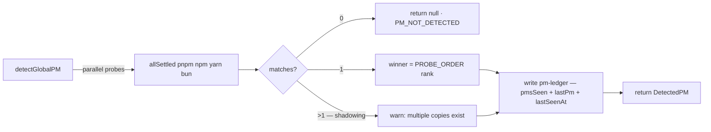

# Phase 2: Detector Split + PM Ledger Store

## Overview

Tách `detector/` theo target layout của user (`pm.ts` shared constants, `global-pm.ts` probe), upgrade probe serial → **parallel**, và build store module (`env-paths` + own implementation) chứa **PM ledger** — nơi ghi lại PM nào từng được dùng để install global.

## Requirements

- [x] `src/core/detector/pm.ts` — extract shared: `PM_DISPLAY_NAMES`, `PROBE_ORDER`, type re-exports; `global-pm.ts` giữ global-specific (LIST_GLOBAL_COMMANDS, parseVersionFromList, detectGlobalPM)
- [x] Parallel probe: `detectGlobalPM` chạy 4 probes đồng thời (`Promise.allSettled`), rank theo `PROBE_ORDER`, first-match wins — wall-time ~1 subprocess thay vì 4 serial
- [x] Store module `src/core/store/index.ts`: dùng **`conf`** (sindresorhus) — community precedent (lineage `configstore` ← update-notifier). conf handle sẵn: config location per-platform (Linux XDG `~/.config` ✅), atomic writes, schema validation, dot-prop get/set. Wrap thin typed layer theo repo convention (như logger wraps consola)
- [x] **Graceful degradation (kongming gate #2 — REQUIRED)**: wrap `new Conf()` trong try/catch — `EACCES`/`EROFS` (CI, Docker, read-only HOME) → log debug "stateless mode", store = null, CLI vẫn hoạt động đầy đủ không persist. Mọi read/write qua null-safe helpers
- [x] Single store, namespaced keys (cách update-notifier/configstore vẫn làm): key `pmLedger` chứa `{ pmsSeen: [...], lastPm, lastSeenAt }`; key `pm` (user override) + `updateCheck` (Phase 04) thêm sau
- [x] PM ledger: sau detect thành công → write `pmLedger`; uninstall đọc ledger → nếu có PM khác ngoài PM hiện tại → info "previously installed via X — leftover copy possible"
- [x] Multi-PM awareness: parallel probe thu **tất cả** matches (không chỉ first) → nếu >1 PM có package → warn trong confirm prompt (shadowing detection)
- [x] `eslint.ts`/`prettier.ts` KHÔNG tạo phase này — defer Phase 03 scaffold (lockfile-based, dùng `package-manager-detector` lib, không subprocess probe)

## Architecture

```
src/core/detector/
├── pm.ts          # shared constants + types (mới)
├── global-pm.ts   # parallel probe + version parse (refactor)
└── types.ts       # DetectedPM

src/core/store/
└── index.ts       # conf wrapper — typed get/set, namespaced keys (pmLedger, pm, ...)
                   # location: conf mặc định (Linux ~/.config/jss-devtools-nodejs/config.json,
                   # macOS ~/Library/Preferences/..., Windows %APPDATA%)
```



## Related Code Files

- Create: `src/core/detector/pm.ts`, `src/core/store/index.ts`
- Modify: `src/core/detector/global-pm.ts` (parallel + import từ pm.ts), `src/commands/self/uninstall.ts` (ledger warn), `package.json` (thêm `conf` dep), `tests/smoke.test.ts`
- Delete: không

## Implementation Steps

1. Extract `pm.ts` từ `global-pm.ts` (constants + types); update imports ở `exec.ts` (đang import PM_DISPLAY_NAMES)
2. Refactor `detectGlobalPM`: parallel `allSettled`, collect tất cả matches, rank winner
3. Add dep `conf`; viết `src/core/store/index.ts` — conf instance `projectName: 'jss-devtools'` bọc try/catch EACCES/EROFS (stateless fallback), typed helpers `getPmLedger()/recordPmSeen(pm)/setPmOverride()/getPmOverride()` — tất cả null-safe khi store unavailable
4. Hook ledger write vào `detectGlobalPM` sau khi detect (fire-and-forget try/catch, không block)
5. `uninstall.ts`: đọc ledger → warning line nếu `pmsSeen` có PM ≠ winner
6. Tests: parallel probe (mock execa), ledger write/read round-trip qua conf, conf `cwd` option trỏ temp dir cho test isolation, graceful degradation (mock constructor throw EACCES → CLI vẫn chạy)
7. Verify: `pnpm lint && pnpm typecheck && pnpm test && pnpm build` + smoke uninstall `--dry-run`

## Todo

- [x] pm.ts extraction
- [x] Parallel probe + shadowing warn
- [x] conf dep + store/index.ts wrapper
- [x] uninstall ledger warning
- [x] Tests + verify

## Success Criteria

- [x] Probe wall-time giảm serial→parallel (verify timing thủ công)
- [x] Ledger xuất hiện sau lần detect đầu (conf-managed file tại config location của platform)
- [x] Shadowing: install global bằng 2 PMs → uninstall confirm prompt warn cả 2
- [x] Xóa conf file → CLI vẫn hoạt động (regenerate), không crash
- [x] Read-only HOME (mock EACCES) → CLI chạy stateless, không throw (kongming gate #2)
- [x] lint/typecheck/test/build xanh

## Risk Assessment

| Risk | Mitigation |
|---|---|
| Parallel probe thấy nhiều PM copies → chọn sai để uninstall | Confirm prompt hiển thị đầy đủ matches + winner; user abort được |
| Read-only HOME / CI / Docker → conf constructor throw (kongming) | Try/catch EACCES/EROFS → stateless mode, null-safe helpers |
| Ledger write fail (permission) | Fire-and-forget + try/catch — detection không phụ thuộc ledger |
| conf limitation: đọc/ghi cả file mỗi lần, không multi-process concurrent | Ledger nhỏ (max ~5 PMs), CLI single-process — chấp nhận được (kongming verified) |
| conf location khác platform kỳ vọng | Log debug path thực tế (`store.path`); smoke test trên macOS, CI Linux |
| Scope creep sang scaffold detectors | Giữ `eslint.ts`/`prettier.ts` OUT — Phase 03, lockfile-based |

## Advisory Log

- Kongming gate #2 (2026-08-21): **GO** + required graceful degradation cho read-only fs. Full report: `../reports/kongming-260821-1105-persistent-store-design-review.md`
- Kongming phase-02 finalize checkpoint (2026-08-21): **GO** — "A-tier". Report: `../reports/kongming-260821-1151-phase-02-finalize.md`
- Code-reviewer (2026-08-21): DONE_WITH_CONCERNS → resolved. H1 graceful-degradation dead code (constructor DOES I/O with clearInvalidConfig — verified via stack trace; belt-and-braces guard constructor + helpers). H2 `clearInvalidConfig: true` self-heal corrupted JSON. M1 smoke store isolation. M2 conf tsup external. M3 notes embedded in JSON envelope (stdout purity). L1 PM_DISPLAY_NAMES.
