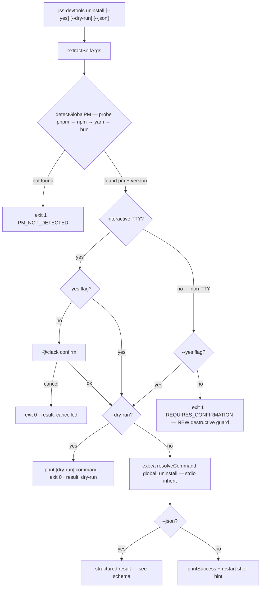
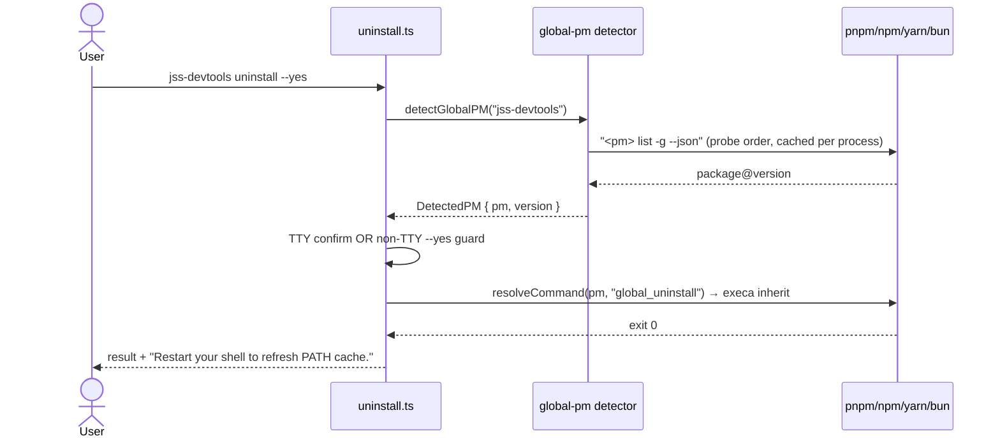

# Uninstall Command Design

## Overview

Thiết kế (và harden) self command `jss-devtools uninstall` — command gỡ CLI khỏi global install qua PM đã detect. Đây là command **đầu tiên** trong bộ per-command design docs (uninstall → upgrade/downgrade → update), làm template cho các command sau.

Design review (kongming, 2026-08-21): **GO** cho cả 3 fixes. Package chưa publish → schema changes free, không breaking.

## Goals

| # | Goal | Priority |
|---|------|----------|
| 1 | Design doc đầy đủ flow uninstall (flowchart + sequence, mermaid) | P1 |
| 2 | Fix 1 — `json` flag default `true` → `false` (thống nhất contract 4 commands) | P1 |
| 3 | Fix 3 — dry-run JSON status: `'cancelled'` → `'dry-run'` (schema mới) | P1 |
| 4 | Fix 2 — non-TTY guard cho destructive op: uninstall không `--yes` trong non-TTY → exit 1 | P1 |
| 5 | Detector split (`pm.ts` shared) + parallel probe + PM ledger store (`conf`) | P1 |

## Current State (verified từ source)

```
uninstall.ts → extractSelfArgs → requireGlobalPM (probe + cache)
            → confirmOrCancel (TTY confirm | --yes skip | non-TTY auto-proceed ⚠️)
            → execOrDryRunRemove (resolveCommand pm 'global_uninstall' | dry-run print)
            → output (json | printSuccess + PATH hint)
```

**3 design gaps (evidence):**

| # | Gap | Evidence |
|---|-----|----------|
| 1 | `json` default `true` — lệch chuẩn 3 commands kia (default `false`) | `uninstall.ts` args.json.default |
| 2 | Non-TTY auto-proceed destructive op — CI/script gỡ CLI ngầm không confirm | `prompts.ts` `if (options.yes \|\| !isTTY()) return` |
| 3 | Dry-run báo `result: "cancelled"` — sai semantics cho automation | `uninstall.ts` + `update-shared.ts` `dryRun ? 'cancelled' : 'success'` |

## Target Design

### Decision flow



### Runtime sequence



### JSON result schema (v2 — pre-publish, free change)

```jsonc
{
  "schemaVersion": "1.0",
  "pm": "pnpm",
  "package": "jss-devtools",
  "dryRun": false,
  "command": "uninstall",
  "result": "success",       // success | dry-run | noop | cancelled | error  ← NEW 'dry-run'
  "current": "0.1.0",
  "cmdStr": "pnpm remove -g jss-devtools",
  "message": "Uninstalled jss-devtools@0.1.0"
}
```

### Non-TTY semantics — per-command, không uniform

| Command | Non-TTY không `--yes` | Lý do |
|---|---|---|
| **uninstall** | **exit 1** `REQUIRES_CONFIRMATION` | Destructive — mất tool, npm precedent (`npm uninstall -g` cần explicit consent trong automation) |
| upgrade / downgrade | auto-proceed (giữ nguyên) | Reversible — CI cần `jss-devtools upgrade` chạy hands-free, đúng precedent pnpm self-update / bun upgrade |

Implement qua option `destructive?: boolean` trong `ConfirmOptions` (single source `confirmOrCancel`, không duplicate per-command logic).

## Key Decisions

| Decision | Chosen | Alternative (rejected) |
|---|---|---|
| Dry-run status | `'dry-run'` distinct status | Giữ `'cancelled'` + field `dryRun:true` — status field phải authoritative (kongming) |
| Non-TTY guard scope | Chỉ uninstall (destructive flag) | Uniform guard cả 4 commands — block self-update trong CI, ngược precedent |
| Guard mechanism | Option trong `confirmOrCancel` | Guard riêng trong uninstall.ts — duplicate logic, DRY violation |
| Fix order | Fix 1 → Fix 3 → Fix 2 | Kongming: consistency → schema → safety (safety sau cùng vì cần verify blast radius) |
| Store impl | **`conf`** (community precedent, lineage configstore ← update-notifier) — strategy "học theo tiền bối, không remake" | env-paths + tự viết store — remake những gì community đã handle |
| Store shape | Single store, namespaced keys (`pmLedger`, `pm` override, `updateCheck`) — cách update-notifier làm | Tách config vs cache file (XDG-purist) — over-engineering cho giai đoạn này |
| PM persistence | **Không cache PM detection** — parallel probe mỗi lần (~300-600ms, zero stale risk); persist chỉ ledger (history) + user override | Cache + trust — stale risk đâm nhầm PM khi uninstall |
| Detector layout | `pm.ts` (shared constants) + `global-pm.ts` (subprocess probe) — eslint/prettier.ts defer Phase 03 lockfile-based | Tạo sẵn 4 files — YAGNI trước khi scaffold tồn tại |

## Phases

| # | Phase | Status |
|---|-------|--------|
| 1 | [Phase 1: Uninstall Hardening Implementation](./phase-01-start.md) | Completed |
| 2 | [Phase 2: Detector Split + PM Ledger Store](./phase-02-detector-split-pm-ledger-store.md) | Completed |

## Success Criteria

- [x] Flowchart + sequence diagram render đúng (mermaid v11) trong plan
- [x] `json` default `false` ở uninstall — đồng bộ 4 commands
- [x] `CommandResultStatus` thêm `'dry-run'` — uninstall + update-shared dùng status mới
- [x] Non-TTY `uninstall` không `--yes` → exit 1 + `REQUIRES_CONFIRMATION`
- [x] Non-TTY `upgrade`/`downgrade` vẫn auto-proceed (không regression)
- [x] Parallel probe thay serial · ledger ghi được PM từng install · shadowing warn
- [x] Smoke tests cover 3 fixes · `pnpm lint`/`typecheck`/`test`/`build` xanh

## Relations

- Hoàn thiện chi tiết cho [phase-02-cli-self-management.md](../phase-02-cli-self-management.md) (completed — đây là hardening pass)
- Schema v2 + unit tests feed [phase-04-polish-publish.md](../phase-04-polish-publish.md) (pre-release full test suite)
- Template cho design docs của upgrade/downgrade/update (làm sau)

## Dep Mapping (user-provided refs — dùng khi cần)

| Dep | Vai trò | Khi nào thêm |
|---|---|---|
| `conf` | Store (đã chốt phase-02) — successor của `configstore` | Phase 02 |
| ~~`configstore`~~ | Tổ tiên của conf — KHÔNG thêm, conf thay thế | — |
| `update-notifier` | Tier-1 notify (chốt trước đó: Phase 04 sau publish) | Phase 04 |
| ~~`latest-version`~~, ~~`boxen`~~ | Internal deps CỦA update-notifier — không khai báo trực tiếp | — |
| `semver` | Đã là direct dep (version-resolver đang dùng) ✅ | có sẵn |

## Unresolved Questions

Không có — kongming đã review GO, blast radius đã verify (cả 4 commands dùng `confirmOrCancel`, guard scope chốt per-destructive).
