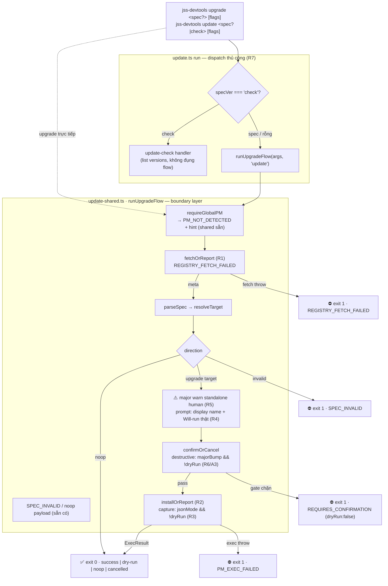

# Upgrade Command Design

## Context

Thứ hai trong bộ self-command design docs (`uninstall` → **`upgrade`** → downgrade → update-check), theo reference implementation `plans/260821-1050-uninstall-command-design/` (closed 2026-08-27, 44/44 tests).

- Mọi learnings uninstall được reuse tự do: detector hardened (npm 11 + yarn NDJSON + probe timeout), logger stream contract (logs→stderr + EPIPE guard), `PM_NOT_DETECTED` + install-hint (`flow.ts`), `ExecOptions.capture` trong `exec.ts`.
- Registry reality (verify 2026-08-28): `jss-devtools` trên npm thuộc user (maintainer `jjuidev`), old-lineage `dist-tags.latest = 1.0.0` (code cũ, 2026-07-13). Rewrite 0.1.0 chưa publish → `upgrade` resolve 0.1.0→1.0.0 old-lineage. Real-exec manual-test CẤM tới khi 0.1.0 publish.
- Live probe 2026-08-28 xác nhận G3/G4/G5 bằng chạy thật (npm chatter trộn stdout; cmdStr `npm i -g` ≠ prompt hardcode `add -g`; major jump im lặng non-TTY).
- Kongming GO: `plans/reports/kongming-260828-1229-upgrade-design-go-no-go.md` — A1/A2/A3 absorbed bên dưới.

**Supersede note:** bảng "non-TTY auto-proceed cho upgrade/downgrade/update" trong uninstall plan (2026-08-21) bị thu hẹp bởi plan này: auto-proceed chỉ còn khi KHÔNG phải major bump (gate A3). Không phải regression — intent change có chủ đích.

## UX Surface

```
jss-devtools upgrade <spec_version?> [--yes] [--dry-run] [--json]
jss-devtools update  <spec_version?|check> [flags]   # alias đầy đủ của upgrade + check
```

- `<spec_version?>`: optional, validate qua `parseSpec` → `SPEC_INVALID` nếu không resolve được. Omit → `dist-tags.latest` (fallback newest stable).
- `update check`: list versions (giữ nguyên tên cũ). **Bỏ `list`/`ls`** — user overrule kongming-default (additive) 2026-08-28.
- **Contract change có ý (A1 side-effect):** `update bogus` từ citty usage-dump thô → `SPEC_INVALID` structured JSON (đúng semantics alias).

## Target Design

### Decision flow (as-designed)



### Gate matrix (A3 — final)

| Ngữ cảnh | Hành vi |
|---|---|
| TTY, không `--yes` | @clack prompt (giữ nguyên) |
| non-TTY, không `--yes`, **major bump** | exit 1 `REQUIRES_CONFIRMATION` (payload `dryRun: false` — G6 tiền đề) |
| non-TTY, không `--yes`, minor/patch | auto-proceed (CI hands-free) |
| có `--yes` | đi qua mọi bump |
| có `--dry-run` | **không bao giờ gate** (không mutate gì) |

## Phases

| # | Phase | Status |
|---|-------|--------|
| 1 | [Phase 1: Hardening Implementation](./phase-01-hardening-implementation.md) | Completed — local, chờ manual test + commit |

## Success Criteria

- [x] Fetch fail (network/404/5xx/timeout) → `REGISTRY_FETCH_FAILED` rich-form, exit 1, không stack — json lẫn human
- [x] Exec fail (resolveCommand-null / execa non-zero) → `PM_EXEC_FAILED` rich-form, exit 1, không stack
- [x] `--json` real-exec: stdout đúng 1 doc mọi outcome (capture bật) — `| jq` sạch
- [x] Prompt dùng `PM_DISPLAY_NAMES` + "Will run" built từ `resolveCommand` (npm `npm i -g`, yarn `yarn global add`) + lockstep test
- [x] Major bump: ⚠️ standalone human kể cả `--yes`; non-TTY không `--yes` → `REQUIRES_CONFIRMATION` (`dryRun: false`); minor/patch auto-proceed; `--dry-run` miễn gate
- [x] `update` nhận positional spec (alias đầy đủ); `update check` KHÔNG double-exec flow upgrade (regression test + binary-level smoke); `update bogus` → `SPEC_INVALID` structured
- [x] Cancelled payload `dryRun` đúng giá trị thật (G6)
- [x] `pnpm lint` / `typecheck` / `test` / `build` xanh (69/69: 44 cũ + 21 upgrade + 4 normalization, zero regression)

## Relations

- Kế thừa: `plans/260821-1050-uninstall-command-design/` (closed) — reference implementation, 3-tier framework, boundary-guard precedent
- Kongming: `plans/reports/kongming-260828-1229-upgrade-design-go-no-go.md` (GO + 3 amendments)
- Kế tiếp: downgrade design doc (G1-G6 mirror + DRY-merge vào `runUpgradeFlow` + fold Will-run formatter vào exec.ts khi được phép đụng core) · update-check internals follow-up

## Unresolved Questions

Không có — kongming GO, user đã ack 3 amendments + overrule list/ls (2026-08-28).
