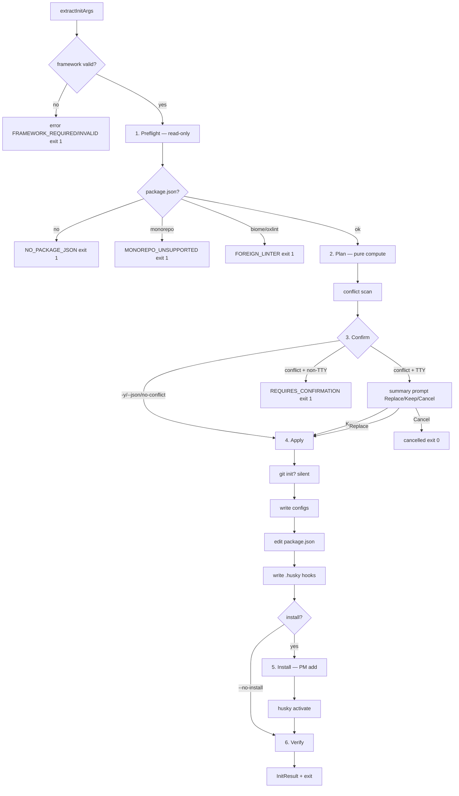

# Phase 2 — Flow Design (`jss-devtools init`)

Status: draft — chờ user review | Input: phase-01 surface (approved 22:52) + scout + kongming counsel

## 1. Pipeline tổng quan



## 2. Flag → flow matrix

| Flag combo | Confirm behavior | Mutation | Result |
|---|---|---|---|
| default (TTY) | 1 summary prompt (conflicts + install) | full | success |
| `-y` | none — conflict auto-**Replace** | full | success |
| `--json` | none (json auto-default như `-y`, theo convention `confirmOrCancel`) | full | JSON stdout |
| `--dry-run` | none — plan print (human/json) | **zero** | dry-run |
| `--no-install` | bình thường | configs + manifest, **không** PM exec | success + hint |
| `--no-linter` | bình thường | bỏ eslint/prettier/ppj + **bỏ pre-commit hook** (approved) | success |
| `--no-commitlint` | bình thường | bỏ commitlint config + commit-msg hook + 2 pkgs @commitlint/* | success |
| conflict + non-TTY, không `-y/--json` | — | none | exit 1 `REQUIRES_CONFIRMATION` |

## 3. Stage specs

### 3.1 Preflight (read-only, fail-fast theo thứ tự)

1. `package.json` ở cwd: thiếu → `NO_PACKAGE_JSON` exit 1 (hint: chạy trong project JS/TS).
2. Parse JSON: fail → `PACKAGE_JSON_INVALID` exit 1.
3. **Monorepo signals:** `pnpm-workspace.yaml` ∣ field `workspaces` ∣ dep chứa `workspace:*` → `MONOREPO_UNSUPPORTED` exit 1 + hint (liệt kê artifact phát hiện).
4. **Foreign linter guard:** `biome.json*` ∣ `.oxlintrc*` → `FOREIGN_LINTER` exit 1 (hint: migrate thủ công rồi chạy lại).
5. **PM detection** (thứ tự, không dùng global detector làm nguồn chính — kongming):
   1. `packageManager` field (tách name/version; yarn → phân biệt berry qua `.yarnrc.yml`)
   2. Lockfile: `pnpm-lock.yaml`→pnpm · `package-lock.json`→npm · `yarn.lock`→yarn · `bun.lockb`/`bun.lock`→bun
   3. nypm guess (API verify Phase 3)
   4. TTY → prompt select npm/pnpm/yarn/bun · non-TTY → `PM_UNDETECTED` exit 1
6. **Git state:** có `.git` → plan ghi `git: noop`; không → plan action `git init -b main` (silent, không log).
7. Quét artifacts hiện có → conflict list (cho Stage 2).

### 3.2 Plan computation (pure — không side effect)

Input: `InitArgs` + manifest snapshot + PM + git state + conflict list.
Output: `InitPlan` — list actions có thứ tự:

```ts
type PlanAction =
  | { kind: 'git-init' }                                   // chỉ khi chưa có .git
  | { kind: 'write-file'; path: string; content: string }
  | { kind: 'manifest-edit'; scripts?: Record<string, string>; lintStaged?: unknown; deps?: DepEdits }
  | { kind: 'install'; commands: string[]; devSpecs: string[]; specs: string[] }
  | { kind: 'husky-activate' }                             // <pm> exec husky — sau install
```

Quy tắc:
- **Idempotency:** content-compare — planned content === file trên đĩa → drop action (noop). Re-run sau success = toàn noop → status `noop`.
- **Không đụng của user:** dep user đã khai báo (bất kỳ field nào) → không thêm/sửa, chỉ ghi nhận `skipped` reason. Scripts `prepare`/`format` đã tồn tại → skip, không clobber.
- DepEdits theo decision 8 (plan.md): tooling → devDependencies; framework runtime: app (`private:true`) → dependencies; library (non-private + `exports`/`types`) → peerDependencies + devDependencies copy; `peerDependenciesMeta` chỉ khi optional thật.
- **Khi install on:** deps được ghi bởi chính `pm add` (tránh double-write manifest, PM tự resolve peers) — manifest-edit chỉ chứa scripts + lint-staged. Ghi tay deps vào manifest CHỈ khi `--no-install`.
- **Version resolution phải đọc peerDependencies** từ registry metadata khi chọn version set (fetchPackageMetadata) — tránh chọn latest độc lập từng pkg rồi die ở `pm add` vì peer conflict (pnpm strict peers; eslint major mới vs eslint-config-next/typescript-eslint lag).

### 3.3 Confirm

- **1 prompt tổng duy nhất** (kongming — thay per-file): hiển thị conflicts + files sẽ ghi + install commands.
- Conflict: `Replace all` (default) ∣ `Keep existing` (drop write đó + drop **plugin preset-specific** gắn với config bị keep; **core linter deps vẫn cài** — eslint, @eslint/js, typescript-eslint, globals, prettier, typescript, husky, lint-staged — vì `format` script + lint-staged vẫn gọi chúng) ∣ `Cancel` → `cancelled` exit 0. `skipped` reasons phải phản ánh đúng dropped-vs-kept.
- Không conflict (chỉ file mới) → không prompt, chạy thẳng (kể cả non-TTY).
- `--json` auto-default như `-y` (Pattern `confirmOrCancel` hiện có).

### 3.4 Apply (thứ tự cố định — mỗi bước idempotent)

1. `git init -b main` (nếu cần) — **trước** husky (husky cần git repo), silent.
2. Write config files: `eslint.config.mjs`, `.prettierrc.json`, `.prettierignore`, `commitlint.config.mjs`, tsconfig (gen/merge).
3. Edit `package.json`: scripts (`prepare: "husky"`, `format: "eslint --fix <globs> && prettier --write <globs>"`), field `lint-staged`; deps specs CHỈ khi `--no-install` (ngược lại `pm add` tự ghi). Ghi bằng `JSON.stringify(m, null, 2) + '\n'` — key order bảo toàn (insertion order), chỉ mất whitespace — KHÔNG tự chạy ppj (kongming: ppj chạy ở commit kế tiếp qua lint-staged).
4. Write `.husky/pre-commit` + `.husky/commit-msg` (shebang `#!/usr/bin/env sh`, chmod 0o755 — skip chmod trên win32):
   - pre-commit (chỉ khi linter on): gọi `lint-staged` qua PM exec map (bảng §4b)
   - commit-msg (chỉ khi commitlint on): `<pm-exec> commitlint --edit "$1"`
   - File hook có sẵn nội dung user → **merge pattern jss-cli**: giữ mọi dòng user, bỏ sample `npm test`, đảm bảo đúng 1 dòng lint-staged/commitlint.
5. Install: `<pm> add -D <devSpecs>` (+ `<pm> add <specs>` nếu app cần runtime). 1 invocation mỗi loại. **Lưu ý lifecycle:** `prepare: "husky"` (bước 3) được `pm add` trigger trong install → activation thật thường xảy ra ngay ở bước này.
6. Husky activate: `<pm-exec> husky` — idempotent safety net (cần khi user đã có `prepare` từ trước → bước 3 skip → lifecycle không chạy).
7. `--no-install`: bỏ 5+6; hooks inert cho tới khi user install → hint trong result. **Warning thêm** khi `git config core.hooksPath` đã trỏ chỗ cũ (husky đời trước) + install không chạy/fail → hooks mới live mà deps chưa có → commit fail khó hiểu.

### 3.5 Verify (read-only post-apply)

- Mọi planned write: tồn tại; file JSON parse được.
- `.husky/*`: có exec bit.
- `package.json` parse được sau edit.
- Install exit code ok (từ ExecResult).
- `.git` tồn tại.

### 3.6 Result + exit

- `InitResult` theo contract phase-01 §7 **+ thêm `conflicts: Array<{ path: string; resolution: 'replaced' | 'kept' | 'none' }>`** (json mode cần thấy resolution). Install fail → result vẫn list đầy đủ generated/modified (không rỗng), status `error`, exit 1.
- Human mode in summary (generated/modified/skipped + next steps); json mode stdout.
- Install fail (PM exit ≠ 0) → `error` exit 1 + recovery hint: "đã ghi config — fix xong re-run, các phần xong sẽ noop". Internal bug → exit 2.

## 4. Framework preset matrix (node ∣ react ∣ next)

| Concern | node | react | next |
|---|---|---|---|
| ESLint devDeps | eslint, @eslint/js, typescript-eslint, globals | + eslint-plugin-react, eslint-plugin-react-hooks | eslint-config-next (flat presets — verify Phase 3) |
| eslint.config.mjs | js.recommended + tseslint.recommended + globals.node | + react/react-hooks blocks + globals.browser | next flat presets |
| tsconfig | ES2024/NodeNext, strict, `paths: {"@/*": ["src/*"]}` | jsx react-jsx, moduleResolution bundler, lib dom, `@/* → src/*` | plugin next, moduleResolution bundler, jsx preserve, `@/* → src/*` |
| tsc-alias devDep | có (repo convention) | không (bundler resolve) | không (next resolve) |
| format globs | `{src,tests}/**/*.{js,ts}` | `{src,app,components,lib}/**/*.{js,jsx,ts,tsx}` | như react |
| @types | @types/node | + @types/react, @types/react-dom | như react |
| Runtime deps check | — | react, react-dom | next, react, react-dom |

Cả 3 preset chung: prettier, prettier (pkgs: prettier), husky, lint-staged, @commitlint/cli, @commitlint/config-conventional, typescript (devDeps). Versions resolve latest stable qua registry-client → caret `^X.Y.Z`.

**tsconfig có sẵn:** không replace — merge tối thiểu: set `paths: {"@/*": ["./src/*"]}` nếu thiếu (**paths standalone, không cần `baseUrl`** — baseUrl đang hướng deprecated; TS ≥4.1 paths hoạt động độc lập). `paths` user đã có → giữ nguyên + `skipped` reason. Không đụng options khác. **Guard solution-style:** tsconfig có `references` hoặc `files: []` (Vite react template) → paths ghi root không hiệu lực → skip + reason + hint (add vào tsconfig.app.json thủ công).

**§4b. PM exec map** (hooks + activation + runner — kongming verified):

| PM | exec map (binary local) | one-off runner (ppj) |
|---|---|---|
| npm | `npx <bin>` | `npx --yes <pkg>@^range` |
| pnpm | `pnpm exec <bin>` | `pnpm dlx <pkg>@^range` |
| yarn v1 | `yarn run <bin>` | fallback `npx --yes <pkg>@^range` (v1 không có dlx) |
| yarn berry | `yarn run <bin>` | `yarn dlx <pkg>@^range` |
| bun | `bunx <bin>` | `bunx <pkg>@^range` |

**Đã verify từ repo (kongming, đóng open items):** lint-staged v17 không breaking — config key `lint-staged` trong package.json vẫn chuẩn (repo chạy ^17.4.1 live). Husky v9: `.husky/_` tự gitignore (`_/.gitignore` = `*`); hook pattern `#!/usr/bin/env sh` + `pnpm exec lint-staged` sống thật trong repo này. Còn duy nhất: skip chmod trên win32.

**ppj runner (thuộc linter):** lint-staged entry `"package.json": ["<runner> prettier-package-json@^2.8.0 --write"]` — runner map: npm→`npx --yes`, pnpm→`pnpm dlx`, bun→`bunx`, yarn berry→`yarn dlx`, yarn v1→fallback `npx --yes`.

## 5. Module layout (blueprint Phase 3)

```
src/commands/init.ts                  # leaf: defineCommand (Phase 1)
src/commands/init/
├── types.ts                          # InitArgs, InitFeatures, FrameworkId, InitResult
├── run-init-flow.ts                  # orchestrator 6 stages
├── utils/
│   ├── args.ts                       # extractInitArgs
│   └── manifest.ts                   # read/patch/write package.json (preserve fields)
├── presets/
│   ├── types.ts                      # FrameworkPreset interface
│   ├── node-preset.ts
│   ├── react-preset.ts
│   └── next-preset.ts
├── plan/
│   ├── types.ts                      # PlanAction, InitPlan
│   ├── compute-plan.ts               # pure builder
│   └── conflicts.ts                  # scan existing configs
├── generators/
│   ├── eslint-config-content.ts
│   ├── prettier-config-content.ts
│   ├── commitlint-config-content.ts
│   ├── tsconfig-content.ts           # gen + merge-min
│   ├── husky-hooks-content.ts        # hook content + user-line merge
│   └── lint-staged-content.ts
└── install/
    ├── resolve-specs.ts              # registry-client → caret specs
    └── build-install-commands.ts     # per-PM add commands
src/core/detector/project-pm.ts       # NEW — reusable (field > lockfile > nypm)
src/core/detector/monorepo-signals.ts # NEW — reusable
src/core/runner/pm-runner.ts          # NEW — one-off runner map (ppj)
```

Boundary: `core/` chỉ chứa infra reusable (detector/runner); logic init-specific nằm `commands/init/` theo kiến trúc hiện có.

## 6. Test plan (outline — chi tiết Phase 3)

**Unit:** extractInitArgs (Phase 1 list) · project-pm order matrix (fake dirs) · monorepo signals · compute-plan per framework × flag combo (expected action list) · generators content snapshot per preset · manifest merge (preserve unknown fields, skip existing scripts, không đụng user deps) · pm-runner map (incl. yarn v1 → npx) · hook user-line merge.

**Integration (temp dir, mock install exec):** full flow per framework **node → react → next** (assert artifacts + manifest) · idempotent re-run → noop · `--dry-run` zero fs mutation (dir snapshot) · `--no-linter` / `--no-commitlint` / `--no-install` paths · conflict Replace/Keep/Cancel (TTY mock) · abort paths (monorepo, foreign linter, NO_PACKAGE_JSON, FRAMEWORK_*) · non-TTY + conflict → exit 1.

**Manual campaign (user gate, per mode):** scratch dir per framework + real install + real commit (thử commit message sai convention → commitlint chặn; commit đúng → lint-staged chạy).

## 7. Open → Phase 3

1. Verify citty `--no-linter` keying bằng unit test (residual duy nhất của surface).
2. `nypm` API surface: dlx mapping + guess function (thay map thủ công nếu có).
3. eslint-config-next flat-config shape trên eslint ^10 + bộ plugin react hiện hành (resolve latest lúc implement, **kèm đọc peerDependencies** để chọn version set tương thích — top risk kongming).
4. Peer-aware version resolution: chọn version set sau khi đọc peerDependencies metadata (fetchPackageMetadata) — tránh `pm add` fail vì peer conflict sau khi đã ghi configs.
5. yarn v1 vs berry detection (`.yarnrc.yml` + `packageManager`).
6. Dry-run offline: registry unreachable → spec placeholder `latest` + warn (không fail).
7. win32: skip chmod exec-bit trên .husky files.

(Đã đóng bởi kongming review 22:57: lint-staged v17 config-shape · husky v9 `_/.gitignore` + hook pattern · prepare-lifecycle ordering · JSON.stringify trade-off · non-TTY no-conflict proceed.)
